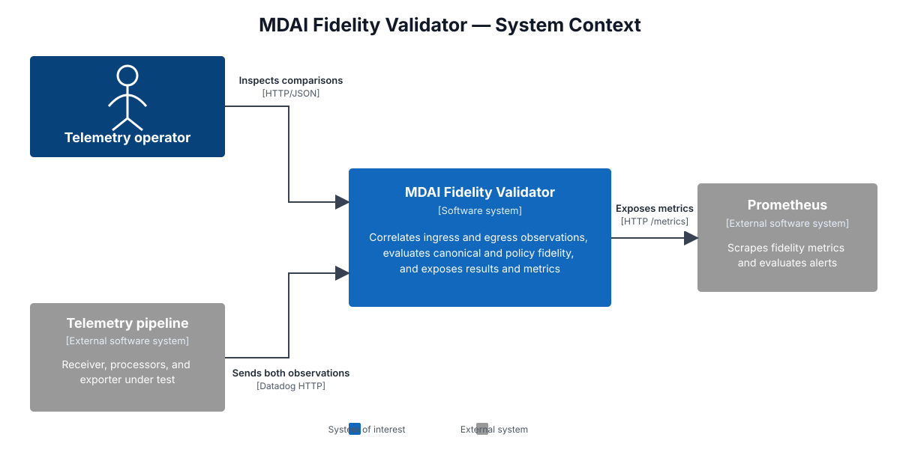

# How mdai-fidelity-validator works

## Purpose

The service observes a telemetry payload on each side of a receiver/exporter
pipeline, correlates the two observations, and answers two different questions:

1. Did all comparable, canonical attributes survive? This is the **full-payload**
   result.
2. Did the attributes declared important by policy survive? This is the
   **required-policy** result.

It is a comparison endpoint, not a forwarding proxy. Both sides send or mirror
their payloads to the validator. The service acknowledges Datadog-style requests,
retains unmatched observations in memory, exposes recent results through an admin
API, and emits cumulative Prometheus metrics.

## C4 system context

The validator sits beside the telemetry path rather than forwarding telemetry
through it. The receiver and exporter each send an observation to the validator,
which compares the pair and publishes operational evidence.

The fixed-layout [C4 SVG source](architecture-c4.svg) uses orthogonal connectors
so relationship labels remain separate. The detailed
[processing flow](architecture.mmd) explains the internal stages, while the
[Structurizr workspace](architecture.dsl) provides container, component, and
dynamic views.

## Runtime map

| Listener | Routes | Role |
|---|---|---|
| `:8126` | any Datadog intake path | Captures the receiver-side observation |
| `:18081` | `/exporter/{name}/...`, other intake paths | Captures the exporter-side observation |
| `:18081` | `/api/v1/validate` | Datadog API-key validation stub |
| `:8080` | `/observe/{receiver\|exporter}/{signal}` | Synthetic observation interface |
| `:8080` | `/results/...`, `/debug/...`, `/admin/pairs`, `/healthz` | Results, diagnostics, and pair configuration |
| `:8888` | `/metrics` | Prometheus exposition |

`cmd/mdai-fidelity-validator/main.go` constructs one `validator.Service` and four
HTTP servers. Shutdown is coordinated by `SIGINT`/`SIGTERM`. All comparison state
is process-local memory, so replicas do not share pending observations or results.
The Helm chart therefore defaults to one replica.

## End-to-end data path

1. **Classify.** The listener determines the source (`receiver` or `exporter`),
   while the request path determines the signal (`traces`, `metrics`, or `logs`).
   A configured fidelity pair is selected by `X-Fidelity-Pair`, mapped port, or
   the default pair.
2. **Capture.** The body is capped at 10 MiB compressed/request size. Selected
   request metadata is retained for diagnostics. Ignored housekeeping paths are
   acknowledged without being counted or compared.
3. **Decode.** `datadog_raw` handles JSON, gzip/deflate/zstd compression,
   MessagePack, Datadog `/series` protobuf, and supported trace protobuf formats.
   Decompression is capped at 50 MiB.
4. **Split batches.** Trace batches become trace groups, metric batches become
   individual series, and merged log entries can be regrouped by
   `correlation_id`. `payloads_received_total` still increments once per HTTP
   request, not once per split item.
5. **Flatten and map.** Decoded wire data is flattened to path/value pairs. The
   field-mapping YAML then selects and transforms those paths into canonical
   snake_case attributes. Exporter-specific mappings override only the named
   canonical keys.
6. **Correlate.** The service derives a signal-prefixed key. Trace intrinsic
   identifiers are preferred; other signals can use a translator-provided
   correlation value, headers, mapped fields, a field fingerprint, or finally a
   raw-body hash.
7. **Pair.** The first side is stored in `pending[correlation]`. An observation
   from the same side replaces it. An opposite-side observation within retention
   removes it and creates a pair. Expired pending data and results are garbage
   collected.
8. **Compare twice.** The canonical maps are evaluated by the full-payload diff
   and independently by the fidelity policy.
9. **Publish.** The latest result is retained for admin lookup, a structured
   summary is logged, and the comparison counters are incremented.

See the [processing flow](architecture.mmd), [request sequence](request-sequence.mmd),
and [metric derivation](metric-derivation.mmd) diagrams.

## Canonicalization is the comparison boundary

The raw decoder produces paths such as `series[0].metric` or
`[0].message`. `field-mapping.yaml` turns selected paths into keys such as
`metric_name`, `service`, or `status`.

Despite the historical phrase “exhaustive flattened-payload comparison,” the
current implementation compares `DecodedPayload.Attributes`: the **canonical
mapped map**, not `RawGroup` and not every decoded wire path. Raw trace groups are
also used for span-by-span diagnostics and contribute to
`full_payload_passed`, but their individual span deltas are not emitted as
attribute counter labels.

Consequences:

- A raw field omitted from field mapping is invisible to top-level comparison.
- If mapping produces no canonical attributes, the observation gets a decode
  error and is remembered for debugging but is not paired or counted as a check.
- Both sides must map semantically equivalent wire fields to the same canonical
  name.
- Canonical names must match `^[a-z][a-z0-9_]*$`.

Mapping source expressions support exact keys, `suffix:`, `contains:`, glob
patterns, and pipelines using `json:`, `tag:`, `trim`, and `lower`. Candidate
selection prefers shallower and shorter paths before lexical order.

## Correlation behavior

Every stored key is signal-prefixed, for example `traces:123`, preventing a trace
and metric with the same raw identifier from colliding.

| Signal | Resolution order |
|---|---|
| Traces | mapped intrinsic field (`trace_id`, then `span_id`, then `correlation_id`, including suffix fallbacks); header; fingerprint; raw-body hash |
| Metrics/logs | translator-mapped `correlation_id`; `X-Correlation-ID` or `X-Request-ID`; correlation-like/tag fields; fingerprint; raw-body hash |

For traces, the code comments and the current algorithm prefer `trace_id` before
`span_id`. This is intentional for grouped traces because every span in a group
shares the trace ID. Fingerprints only pair successfully when the selected
identity material is stable on both sides; a deliberately injected correlation
identifier is more reliable.

The pair name is metadata and routing configuration, but the pending map is keyed
only by correlation ID. Correlation IDs should therefore be unique across active
pairs within one service instance.

## The two comparison models

### Full-payload comparison

Before comparison, `correlation_id` is excluded. For logs, a single `[0].` prefix
is removed and synthetic correlation data is stripped from `ddtags` and JSON
messages. The sorted union of canonical keys is classified as:

- matched: present on both sides with equal string values;
- mismatched: present on both sides with unequal values;
- missing: present on only one side.

Trace spans are additionally matched by `span_id` and diffed. Any top-level
mismatch, missing key, failed span, or one-sided span makes
`full_payload_passed=false`.

### Required-policy comparison

Only `required_attributes` for the signal are evaluated. The default comparison
requires presence and equal values. `compare: presence_only` requires the key on
both sides but permits different values. No policy for a signal means the policy
result passes with zero required attribute checks.

`ComparisonResult.passed` is the policy result.
`ComparisonResult.full_payload_passed` is the full-payload result. They can
disagree legitimately.

## Configuration and reload

| Variable | Default | Purpose |
|---|---|---|
| `MDAI_ADMIN_ADDR` | `:8080` | Admin listener |
| `MDAI_METRICS_ADDR` | `:8888` | Prometheus listener |
| `MDAI_DATADOG_AGENT_INGEST_ADDR` | `:8126` | Receiver capture listener |
| `MDAI_EXPORTER_API_ADDR` | `:18081` | Exporter capture/API listener |
| `MDAI_RETENTION` | `30m` | Pending/result retention |
| `MDAI_CONNECTION_NAME` | `default` | Metric identity label |
| `MDAI_FIDELITY_FIELD_MAPPING_PATH` | empty mapping | Canonical field mapping |
| `MDAI_FIDELITY_RULES_PATH` | empty policy | Required fidelity policy |
| `MDAI_CONFIG_RELOAD_INTERVAL` | `15s` | Mapping/policy reload poll interval |

Mapping and policy reload independently. Invalid updates preserve the last known
good value. An empty runtime default is important: running the binary without
mapping configuration does not inherit the example files in
`internal/validator`; the Helm chart mounts its packaged files and sets both path
variables.

## Package guide

| Area | Responsibility |
|---|---|
| `cmd/mdai-fidelity-validator` | Process lifecycle and four HTTP servers |
| `cmd/ddmltgen`, `internal/ddgen` | Synthetic Datadog traffic generation |
| `service_handlers.go` | HTTP routing and acknowledgements |
| `service_payload.go`, Datadog decoder files | Capture, decode, split, flatten |
| `field_mapping*.go` | Canonical mapping and transforms |
| `service_correlation.go` | Correlation resolution and fingerprints |
| `service_observe.go` | Pending state, retention, and metric recording |
| `service_compare.go`, `service_spans.go` | Full canonical and span comparison |
| `policy.go` | Required-policy evaluation |
| `service_debug.go` | Structured summaries and API-key redaction |
| `deployment/` | Helm deployment, configuration, ServiceMonitor |

## Operational constraints

- State and the default Prometheus registry are process-local.
- Counters reset when the process restarts.
- A single pending slot exists per correlation key; repeated same-side payloads
  replace earlier observations.
- Decode/mapping errors do not create pending entries and therefore do not
  directly increment pass/fail comparison metrics.
- The service redacts fields named like `DD_API_KEY` in debug output, but mapped
  telemetry values and metric attribute labels should still be treated as
  operator-controlled data.
